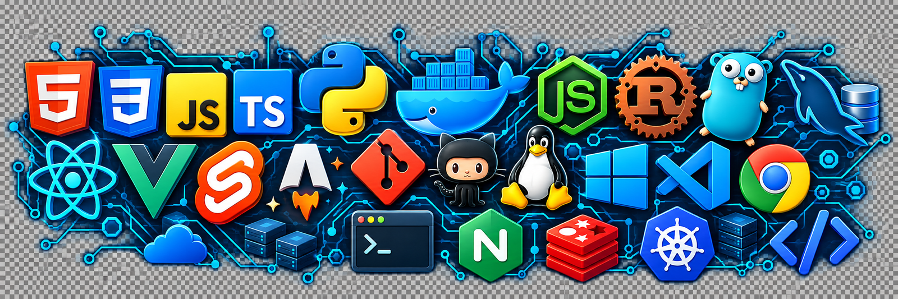

# 👋 Hello
欢迎来到 no01_80 的主页 😝

 

<h1 align="center">
  
</h1>

  

  &emsp;
  

  

💪 正在学习:

&emsp;&emsp;

🚀 正在折腾:

&emsp;&emsp;

🧠 计划学习:

&emsp;&emsp;
睡觉，以及把 `motto` 从“先让它跑起来”升级成“它也好看”

🧰 常用的工具:

&emsp;&emsp;

  

